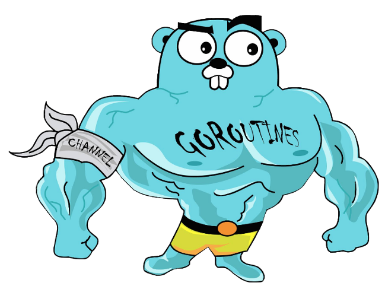
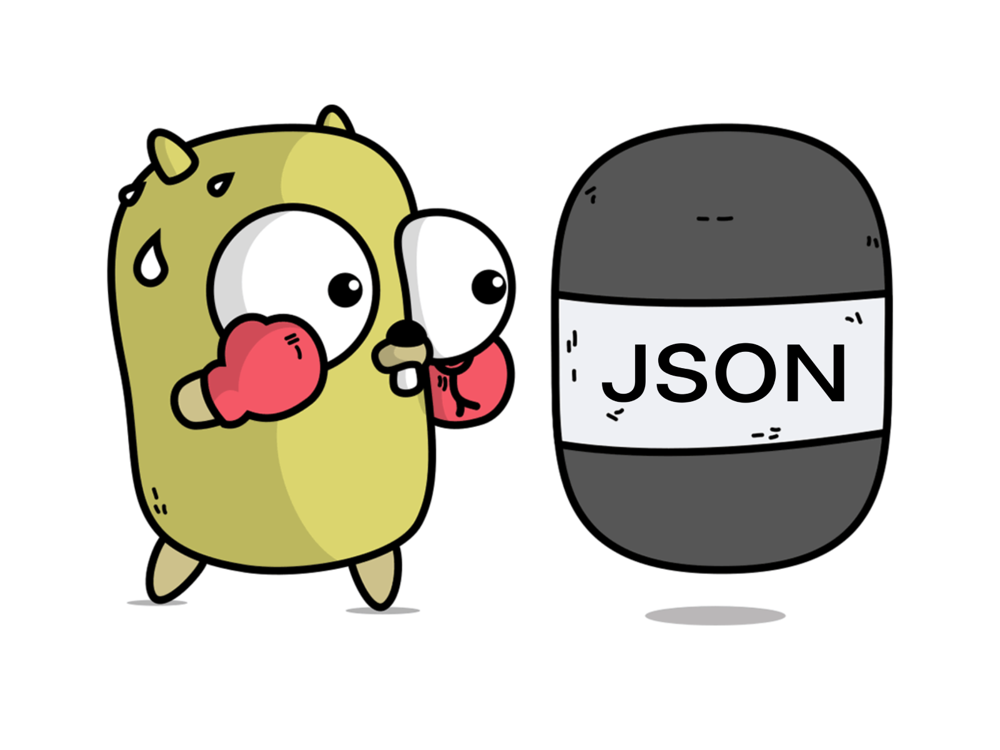

<!-- PROJECT LOGO -->
<br />
<div align="center">
  <a href="https://github.com/Johanx22x/multicore-project">
    
  </a>

  <h3 align="center">Websites Content Analysis Using Multithreading</h3>
</div>

Terminal based program to analyze the metadata of the 1000 most visited websites around the world, 
implementing [Go programming language](https://go.dev/), web scraping with [crawlerclub](https://github.com/crawlerclub/ce), 
multithreading using goroutines and chart libraries with [go-echarts](https://github.com/go-echarts/go-echarts). 
<!--and a local web server to host the charts.-->

The data processed is stored in JSON and CSV files.

<br />
<div align="center">
  <a href="https://github.com/Johanx22x/multicore-project">
    
  </a>
</div>

# Main Menu


# Obtained charts example


# Running instructions

## Dependencies

- [go](https://go.dev/dl/)

## Run the program 
```bash
$ go run main.go
```

# Warning

Do not compile the source code, there is a null pointer error if you try to run the binary file.

Instead use `go run main.go` to run the program.
